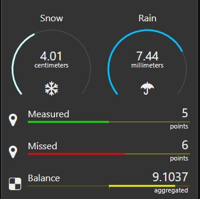

# node-red-contrib-ui-artless-gauge


[![NPM version][npm-image]][npm-url]
[](https://www.codefactor.io/repository/github/hotnipi/node-red-contrib-ui-artless-gauge)


[npm-image]: http://img.shields.io/npm/v/node-red-contrib-ui-artless-gauge.svg
[npm-url]: https://www.npmjs.com/package/node-red-contrib-ui-artless-gauge


## Description


Artless gauge is gauge with minimal design. Gauge has two layouts - linear and radial. Both layouts support regular mode and differential mode. With differential mode, the indicating colored track is drawn from center to side. There are no tick marks or values presented near the gauge track. 





## Configuration
### Size
For linear layout the supported height is 1 unit.
For radial mode the minimal size is 2x2 units. Supported size configuration for radial layout is sqaure (3x3, 4x4, ...). Widget forces different size combinations to be square, based on shortest side.

### Label
Label can be any string. Label field does not support any html for color or size adjustments.

### Icon
Supported icons are same as for dashboard: [Font Awesome 4.7](https://fontawesome.com/v4.7.0/icons/), [Material Icons](https://material.io/resources/icons/?style=baseline) and [Weather icons lite](https://github.com/Paul-Reed/weather-icons-lite). 
Icon field does not support any html for icon appearance adjustments.

### Layout
Choose layout type. Layout can be linear or radial.

### Mode
Option to turn on differential mode. With this option selected, the colored track has center point from which the value is shown. Value of center point is not shown anywhere, as well there is no minimum or maximum marks. Value of center point is exactly between configured min and max.

### Range
Configure minimum and maximum expected values and adjust line color. Add segments and configure colors for them if needed. Note that MIN and MAX options can not be removed. A small dot with segment color can be drawn at the point of segment. To show dot for segment, configure size for dot bigger that zero.

### Track color
Color of track background line can be configured. By default, the site colors used.

### Tickmarks
Min and max values can be shown near the track.
For differential mode, also the center value is shown.
With radial layout the tickmarks can be shown only if layout size is 3x3 units or more.
With linear layout together with differential mode, if unit is not configured empty, it will override center value.

### Format
Unit is displayed near the value field. Unit can be any string.
Value is always rounded according to the configured decimals. Default is zero so value presented as integer.  

## Input 
<code>msg.payload</code> should carry single numeric value.

## Change the configuration at runtime

Many options of widget configuration can be overrided at runtime using the <code>msg.control</code> property.
You can send options one by one, or all together.
Note, that min and max must be part of sectors property.
Change of min or max will not affect sectors if they were configured. But any sector update clears all previously configured sectors except the min and max.
There is no validation on top of incoming sectors configuration.  


``` javascript
var newSectors = [{t:"min",val:5,col:"#00ff00",dot:3},{t:"sec",val:8,col:"#ff0000",dot:3},{t:"max",val:30,col:"#0000ff",dot:3}]
msg.control = {unit:"degrees",label:"Temperature",icon:"fa-thermometer",sectors:newSectors}
```
 

### Licence

This node uses GreenSock animation library GSAP licenced with Standard GreenSock License for non-commercial use https://greensock.com/standard-license/

